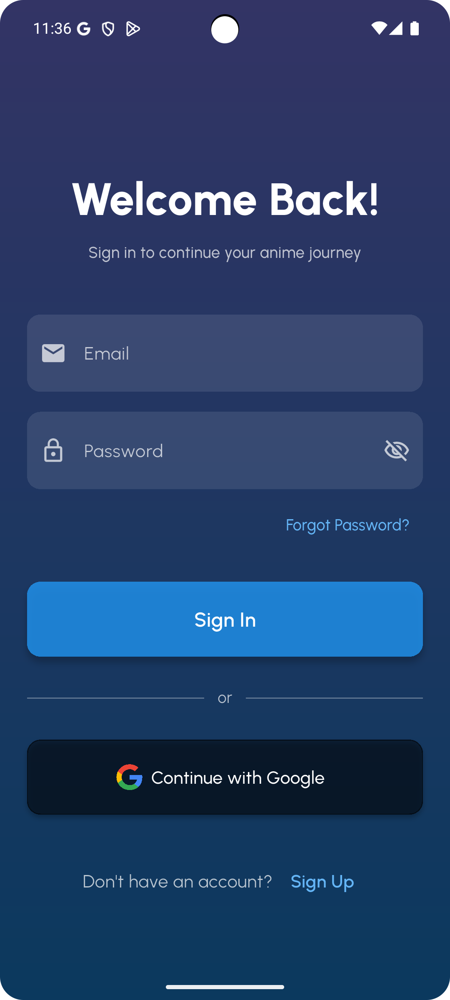
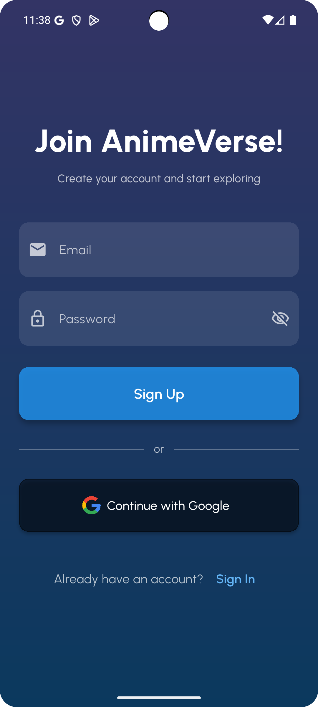
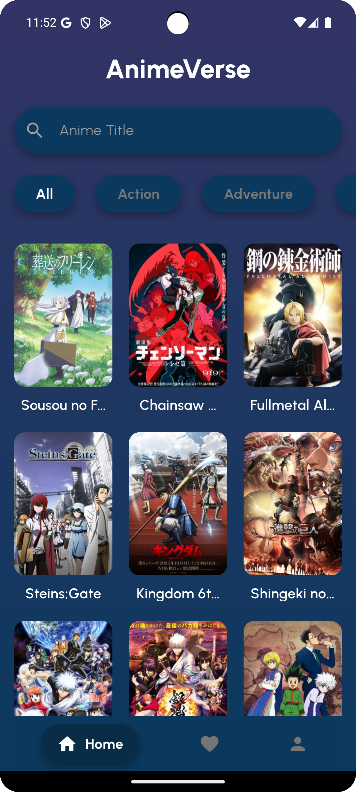
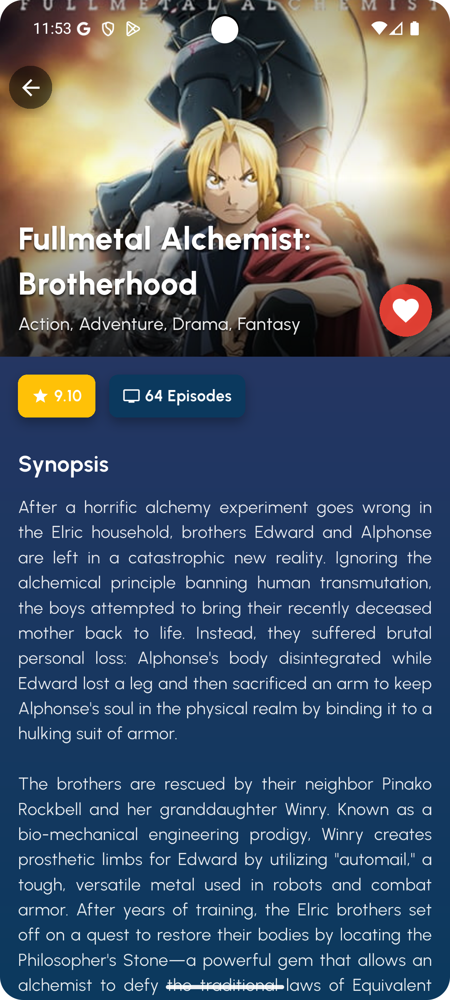
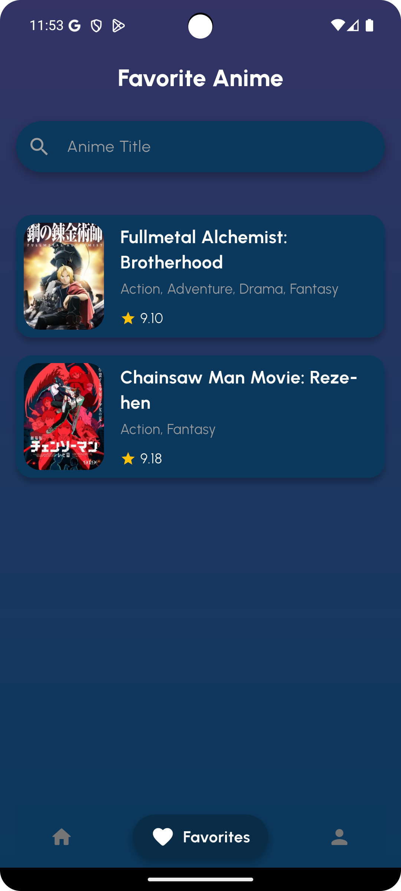

# Anime Verse 🌌

Aplikasi mobile berbasis Flutter untuk menjelajahi informasi anime, melihat detail karakter, dan menyimpan daftar favorit.

## 👤 Identitas Mahasiswa

| Atribut | Keterangan |
| :--- | :--- |
| **Nama** | Chyntia Claudia |
| **NIM** | 231401006 |
| **LAB** | Lab PM 5 |
| **Asisten Lab** | Rivaldo Pardede |

## 📝 Deskripsi Proyek
**Anime Verse** adalah aplikasi yang memungkinkan pengguna untuk mencari dan melihat detail informasi anime menggunakan **Jikan API** (MyAnimeList). Aplikasi ini terintegrasi dengan **Firebase** untuk fitur autentikasi dan penyimpanan data favorit secara *real-time*.

**Fitur Utama:**
* **Authentication:** Login & Register menggunakan Email/Password dan Google Sign-In (Firebase Auth).
* **Anime Discovery:** Menampilkan daftar Top Anime dan Upcoming Anime.
* **Search:** Fitur pencarian anime berdasarkan judul.
* **Detail Info:** Menampilkan sinopsis, rating, genre, dan daftar karakter.
* **Favorites:** Menyimpan anime kesukaan ke dalam daftar favorit (Firestore Database).
* **Profile:** Halaman profil pengguna dengan fitur logout.

## 📱 Link Demo Aplikasi
Berikut adalah video demonstrasi penggunaan aplikasi Anime Verse:

👉 **[TONTON VIDEO DEMO DI SINI](https://youtu.be/D5U_rU1Kqw4)**

## 📸 Screenshots Aplikasi

Berikut adalah tampilan antarmuka aplikasi:

| Login Page | Register Page |
| :---: | :---: |
|  |  |

| Home Page | Detail Page |
| :---: | :---: |
|  |  |

| Favorite Page | Profile Page |
| :---: | :---: |
|  |  |

## 🛠️ Teknologi yang Digunakan
* **Framework:** Flutter (Dart)
* **Backend:** Firebase (Auth, Firestore)
* **API Public:** Jikan API v4
* **State Management:** Provider / setState
* **CI/CD:** GitHub Actions (Automated Build APK)

## 📦 Cara Instalasi (Download APK)
1.  Masuk ke menu **[Releases](https://github.com/chyntiaclaudiaa/lab_pm_5/releases)** di repository ini.
2.  Pilih versi terbaru (misal `v1.0.0`).
3.  Klik pada **Assets** lalu download file `app-release.apk`.
4.  Instal file APK tersebut di perangkat Android kamu.
